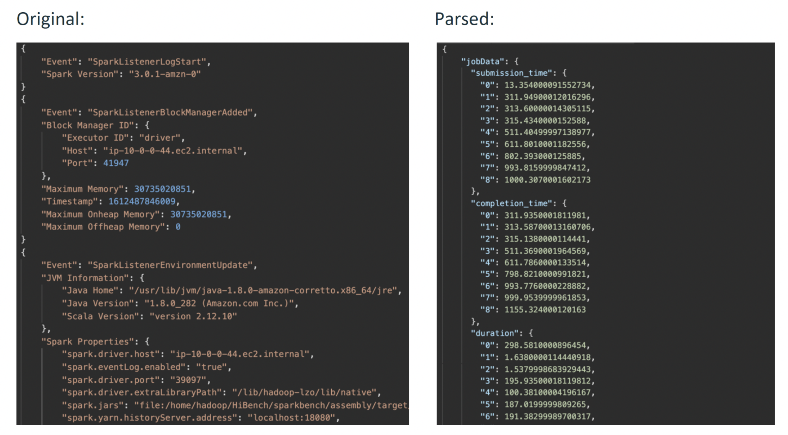

# Spark Log Parser
The **Parser for Apache Spark** parses unmodified Spark history server event logs extracting information to a compact format that can more readily be applied to generating Sync predictions. See the [user guides](https://developers.synccomputing.com/docs/user-guide-emr) for information on where to find event logs. Related tools with their documentation may also be helpful: [client_tools](https://github.com/synccomputingcode/client_tools).

Parsed logs contain metadata pertaining to your Apache Spark application execution. Particularly, the run time for a task, the amount of data read & written, the amount of memory used, etc. These logs do not contain sensitive information such as the data that your Apache Spark application is processing. Below is an example of the output of the log parser.


# Installation
Install the package in this repo to your Python 3 environment, e.g.
```shell
pip3 install https://github.com/synccomputingcode/spark_log_parser/archive/main.tar.gz
```

# Parsing your Spark logs
### Step 0: Generate the appropriate Apache Spark History Server Event log
If you have not already done so, complete the [instructions](https://github.com/synccomputingcode/user_documentation/wiki#accessing-autotuner-input-data) to download the Apache Spark event log.

### Step 1: Parse the log to strip away sensitive information
1. To process a log file, execute the parse.py script in the sync_parser folder, and provide a
log file destination with the -l flag.

    ```shell
    spark_log_parser -l <log file location> -r <results directory>
    ```

    The parsed file `parsed-<log file name>` will appear in the results directory.


2. Send Sync Computing the parsed log

    Email Sync Computing (or upload to the Sync Auto-tuner) the parsed event log.
